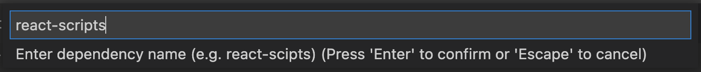

# haiphen-ai vscode extension

This extension allows you to check a package for vulnerabilities. It also allows you to retrieve a short description of the vulnerability. 

## Features

You can either select a dependency from your project's `package.json` file, or search for one by name.

#### Commands

#### Search for package by name

Haiphen-AI returns a list of known vulnerabilities associated with that package. You can select a vulnerability to view its description. 
#### Vulnerabilities list

## Known Issues

More features and an improved UX are planned for the future.

## Release Notes

Users appreciate release notes as you update your extension.

### 0.0.1

Pre-release

---

